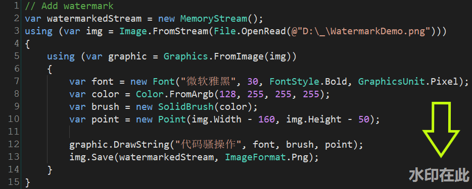
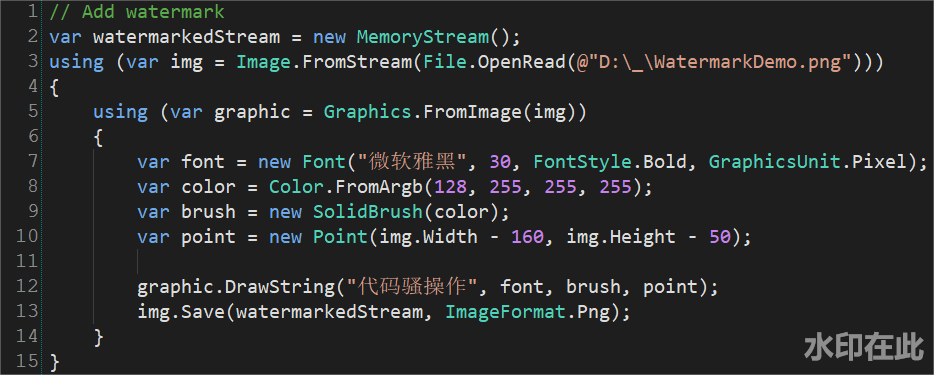
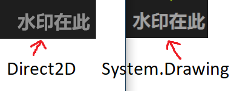

# .NET中生成水印更好的方法
为了保护知识产权，防止资源被盗用，水印在博客、网店等场景中非常常见。

本文首先演示了基于`System.Drawing.Image`做正常操作。然后基于`Direct2D`/`WIC`/`DirectWrite`，演示了一种全新、不同的“**骚**”操作。

# `System.Drawing`给图片加水印
`System.Drawing.Image`原生属于`GDI`的一部分，是Windows Only，但随着NuGet包[System.Drawing.Common](https://www.nuget.org/packages/System.Drawing.Common/)的发布，现在`System.Drawing.Image`已经支持`linux`：
```powershell
Install-Package System.Drawing.Common -Version 4.5.1
```
以下代码演示了如何从给图片加水印：
```C#
// 加水印
var watermarkedStream = new MemoryStream();
using (var img = Image.FromStream(File.OpenRead(@"D:\_\WatermarkDemo.png")))
{
    using (var graphic = Graphics.FromImage(img))
    {
        var font = new Font("微软雅黑", 30, FontStyle.Bold, GraphicsUnit.Pixel);
        var color = Color.FromArgb(128, 255, 255, 255);
        var brush = new SolidBrush(color);
        var point = new Point(img.Width - 130, img.Height - 50);

        graphic.DrawString("水印在此", font, brush, point);
        img.Save(watermarkedStream, ImageFormat.Png);
    }
}
```
效果如图（没有黄色剪头）：


附：Edi.Wang做了一个NuGet包，可以轻松地配置水印参数：
* NuGet：https://github.com/EdiWang/Edi.ImageWatermark
* 文章：https://edi.wang/post/2018/10/12/add-watermark-to-uploaded-image-aspnet-core

# `Direct2D`/`WIC`给图片加水印
`Direct2D`源于`Windows 8`/`IE 10`，安装`IE 10`之后，`Windows 7`也能用。`Direct2D`基于`Direct3D`，很显然，是Windows Only的。

`Direct2D`是`Windows`下一代的2D渲染库，随着`Direct2D`一起发布的，还有`Windows Imaging Component`（简称`WIC`）和`DirectWrite`。

相关说明和文档链接：

| 技术          | 说明                     | 链接                                                                                        |
|---------------|--------------------------|---------------------------------------------------------------------------------------------|
| `Direct2D`    | 基于硬件加速的2D图形渲染 | [Go](https://docs.microsoft.com/en-us/windows/desktop/direct2d/direct2d-portal)             |
| `WIC`         | 高性能图片编码、解码     | [Go](https://docs.microsoft.com/en-us/windows/desktop/wic/-wic-about-windows-imaging-codec) |
| `DirectWrite` | 基于硬件加速的文字渲染   | [Go](https://docs.microsoft.com/en-us/windows/desktop/directwrite/direct-write-portal)      |

如果您打开链接看了一眼，就不难看出，这些技术都是基于`COM`的，但我们使用`.NET`，不是吗？

## 好在我们有`SharpDX`
`SharpDX`对这些`DirectX`技术做了封装，在这个Demo中，我们需要安装`SharpDX.Direct2D1`和`SharpDX.Mathematics`两个包：
```powershell
Install-Package SharpDX.Direct2D1 -Version 4.2.0
Install-Package SharpDX.Mathematics -Version 4.2.0
```
以下代码演示了如何使用`SharpDX.Direct2D1`给图片加水印：
```csharp
using D2D = SharpDX.Direct2D1;
using DWrite = SharpDX.DirectWrite;
using SharpDX;
using SharpDX.IO;
using WIC = SharpDX.WIC;

MemoryStream AddWatermark(Stream fileName, string watermarkText)
{
    using (var wic = new WIC.ImagingFactory2())
    using (var d2d = new D2D.Factory())
    using (var image = CreateWicImage(wic, fileName))
    using (var wicBitmap = new WIC.Bitmap(wic, image.Size.Width, image.Size.Height, WIC.PixelFormat.Format32bppPBGRA, WIC.BitmapCreateCacheOption.CacheOnDemand))
    using (var target = new D2D.WicRenderTarget(d2d, wicBitmap, new D2D.RenderTargetProperties()))
    using (var bmpPicture = D2D.Bitmap.FromWicBitmap(target, image))
    using (var dwriteFactory = new SharpDX.DirectWrite.Factory())
    using (var brush = new D2D.SolidColorBrush(target, new Color(0xff, 0xff, 0xff, 0x7f)))
    {
        target.BeginDraw();
        {
            target.DrawBitmap(bmpPicture, new RectangleF(0, 0, target.Size.Width, target.Size.Height), 1.0f, D2D.BitmapInterpolationMode.Linear);
            target.DrawRectangle(new RectangleF(0, 0, target.Size.Width, target.Size.Height), brush);
            var textFormat = new DWrite.TextFormat(dwriteFactory, "微软雅黑", DWrite.FontWeight.Bold, DWrite.FontStyle.Normal, 30.0f);
            target.DrawText(watermarkText, textFormat, new RectangleF(target.Size.Width - 130, target.Size.Height - 50, int.MaxValue, int.MaxValue), brush);
        }
        target.EndDraw();

        var ms = new MemoryStream();
        SaveD2DBitmap(wic, wicBitmap, ms);
        return ms;
    }
}

void SaveD2DBitmap(WIC.ImagingFactory wicFactory, WIC.Bitmap wicBitmap, Stream outputStream)
{
    using (var encoder = new WIC.BitmapEncoder(wicFactory, WIC.ContainerFormatGuids.Png))
    {
        encoder.Initialize(outputStream);
        using (var frame = new WIC.BitmapFrameEncode(encoder))
        {
            frame.Initialize();
            frame.SetSize(wicBitmap.Size.Width, wicBitmap.Size.Height);

            var pixelFormat = wicBitmap.PixelFormat;
            frame.SetPixelFormat(ref pixelFormat);
            frame.WriteSource(wicBitmap);

            frame.Commit();
            encoder.Commit();
        }
    }
}

WIC.FormatConverter CreateWicImage(WIC.ImagingFactory wicFactory, Stream stream)
{
    using (var decoder = new WIC.PngBitmapDecoder(wicFactory))
    {
        var decodeStream = new WIC.WICStream(wicFactory, stream);
        decoder.Initialize(decodeStream, WIC.DecodeOptions.CacheOnLoad);
        using (var decodeFrame = decoder.GetFrame(0))
        {
            var converter = new WIC.FormatConverter(wicFactory);
            converter.Initialize(decodeFrame, WIC.PixelFormat.Format32bppPBGRA);
            return converter;
        }
    }
}
```
调用方式：
```csharp
File.WriteAllBytes(@"D:\_\Demo2.png", AddWatermark(File.OpenRead(@"D:\_\WatermarkDemo.png"), "水印在此").ToArray());
```
效果也是一切正常：


# 有什么区别？
`System.Drawing`只花了14行，`Direct2D`却需要整整60行！复杂程度惊人！为什么要舍简单求复杂呢？

因为`System.Drawing`没有硬件加速，而且生成的图片也没有反走样(`Anti-aliasing`)，这导致使用`System.Drawing`相比之下较慢，而且生成图片的效果稍差：



很明显可以看出，`Direct2D`生成的图片更平滑。

---
<p style="border: #e0e0e0 1px dashed; padding: 10px 10px 10px 110px; background: url(https://licensebuttons.net/l/by-nc-sa/2.5/cn/88x31.png) #e5f1f4 no-repeat 1% 50%; ">
  <br/>作者：周杰
  <br/>出处：https://www.cnblogs.com/sdflysha
  <br/>本文采用
    <a rel="license" href="https://creativecommons.org/licenses/by-nc-sa/2.5/cn/">知识共享署名-非商业性使用-相同方式共享 2.5 中国大陆许可协议</a>
    进行许可，欢迎转载，但未经作者同意必须保留此段声明，且在文章页面明显位置给出原文连接。
</p>