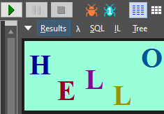
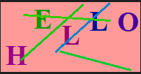
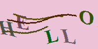
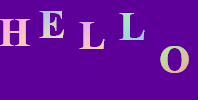
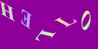
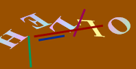
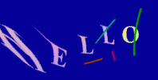
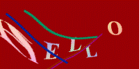
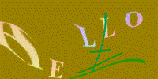
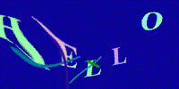

# .NET中生成动态验证码
验证码是图片上写上几个字，然后对这几个字做特殊处理，如扭曲、旋转、修改文字位置，然后加入一些线条，或加入一些特殊效果，使这些在人类能正常识别的同时，机器却很难识别出来，以达到防爬虫、防机器人的效果。

验证码通常用于网站中，是防爬虫、防机器人侵入的好方法。以往.NET中创建验证码，通常会使用`System.Drawing.Image`创建“正常”的验证码。

在前一往篇博客[.NET中生成水印更好的方法](../20190628-dotnet-better-way-watermark/index.md)中，提到了如何给图片加水印。本文将基于上篇博客进一步探索，使用`Direct2D`创建验证码。

# 传统`System.Drawing`的做法
前置条件：引用`System.Drawing`，或者安装NuGet包：`System.Drawing.Common`：
```xml
<PackageReference Include="System.Drawing.Common" Version="4.5.1" />
```
## 首先创建一个有几个文字的图片（基本操作）：
```csharp
byte[] GetImage(int width, int height, string text)
{
    using (var bitmap = new Bitmap(width, height))
    using (var g = Graphics.FromImage(bitmap))
    {
        var r = new Random();

        g.Clear(ColorFromHsl(r.NextDouble(), 1.0f, 0.8f, 0xff));

        var brush = new SolidBrush(Color.Black);
        var fontSize = width / text.Length;
        var font = new Font(FontFamily.GenericSerif, fontSize, FontStyle.Bold, GraphicsUnit.Pixel);
        for (var i = 0; i < text.Length; i++)
        {
            brush.Color = ColorFromHsl(r.NextDouble(), 1.0f, 0.3f, 0xff);
            float x = i * fontSize;
            float y = r.Next(0, height - fontSize);

            g.DrawString(text[i].ToString(), font, brush, x, y);
        }

        // 在这里面加入一些其它效果

        var ms = new MemoryStream();
        bitmap.Save(ms, ImageFormat.Png);
        return ms.ToArray();
    }
}

```
效果（Gif是由LINQPad生成多次截图而来，实际为静态图）：



## 然后再加入一些线条：
```csharp
using (var pen = new Pen(brush, 3))
{
    for (var i = 0; i < 4; ++i)
    {
        pen.Color = ColorFromHsl(r.NextDouble(), 1.0f, 0.4f, 0xff);
        var p1 = new Point(r.Next(width), r.Next(height));
        var p2 = new Point(r.Next(width), r.Next(height));
        g.DrawLine(pen, p1, p2);
    }
}
```
效果（Gif是由LINQPad生成多次截图而来，实际为静态图）：



## 还能做什么？
很遗憾，还有很多可以做，即使是加入线条，机器依然能轻而易举地识别出来。

不过`Edi.Wang`在他的[博客](https://edi.wang/post/2018/10/13/generate-captcha-code-aspnet-core)中也发布了一个生成验证码的`NuGet`包：`Edi.Captcha`，截止目前最新版是1.3.1：
```xml
<PackageReference Include="Edi.Captcha" Version="1.3.1" />
```

这个包基于`System.Drawing`，加入了扭曲效果，加入了一些随机的x坐标偏移，极大地增加了AI识别的难度。

使用方式：
```csharp
CaptchaResult result = CaptchaImageGenerator.GetImage(200, 100, "HELLO");
```
其中CaptchaResult的定义如下：
```csharp
public class CaptchaResult
{
    public string CaptchaCode { get; set; }

    public byte[] CaptchaByteData { get; set; }

    public string CaptchBase64Data => Convert.ToBase64String(CaptchaByteData);

    public DateTime Timestamp { get; set; }
}
```
生成的效果如下（Gif是由LINQPad生成多次截图而来，实际为静态图）：



# `Direct2D`
在前一篇博客中，已经有了`Direct2D`的相关简介。这里将不再介绍。

## 首先从最简单的图片上写文字开始：
```csharp
byte[] SaveD2DBitmap(int width, int height, string text)
{
    using var wic = new WIC.ImagingFactory2();
    using var d2d = new D2D.Factory();
    using var wicBitmap = new WIC.Bitmap(wic, width, height, WIC.PixelFormat.Format32bppPBGRA, WIC.BitmapCreateCacheOption.CacheOnDemand);
    using var target = new D2D.WicRenderTarget(d2d, wicBitmap, new D2D.RenderTargetProperties());
    using var dwriteFactory = new SharpDX.DirectWrite.Factory();
    using var brush = new SolidColorBrush(target, Color.Yellow);
    
    var r = new Random();
    
    target.BeginDraw();
    target.Clear(ColorFromHsl(r.NextFloat(0, 1), 1.0f, 0.3f));
    var textFormat = new DWrite.TextFormat(dwriteFactory, "Times New Roman", 
        DWrite.FontWeight.Bold, 
        DWrite.FontStyle.Normal, 
        width / text.Length);
    for (int charIndex = 0; charIndex < text.Length; ++charIndex)
    {
        using var layout = new DWrite.TextLayout(dwriteFactory, text[charIndex].ToString(), textFormat, float.MaxValue, float.MaxValue);
        var layoutSize = new Vector2(layout.Metrics.Width, layout.Metrics.Height);
        using var b2 = new LinearGradientBrush(target, new D2D.LinearGradientBrushProperties
        {
            StartPoint = Vector2.Zero, 
            EndPoint = layoutSize, 
        }, new GradientStopCollection(target, new[]
        {
            new GradientStop{ Position = 0.0f, Color = ColorFromHsl(r.NextFloat(0, 1), 1.0f, 0.8f) },
            new GradientStop{ Position = 1.0f, Color = ColorFromHsl(r.NextFloat(0, 1), 1.0f, 0.8f) },
        }));

        var position = new Vector2(charIndex * width / text.Length, r.NextFloat(0, height - layout.Metrics.Height));
        target.Transform = 
            Matrix3x2.Translation(-layoutSize / 2) * 
            // 文字旋转和扭曲效果，取消注释以下两行代码
            // Matrix3x2.Skew(r.NextFloat(0, 0.5f), r.NextFloat(0, 0.5f)) *
            // Matrix3x2.Rotation(r.NextFloat(0, MathF.PI * 2)) * 
            Matrix3x2.Translation(position + layoutSize / 2);
        target.DrawTextLayout(Vector2.Zero, layout, b2);
    }
    // 其它效果在这里插入

    target.EndDraw();

    using (var encoder = new WIC.BitmapEncoder(wic, WIC.ContainerFormatGuids.Png))
    using (var ms = new MemoryStream())
    {
        encoder.Initialize(ms);
        using (var frame = new WIC.BitmapFrameEncode(encoder))
        {
            frame.Initialize();
            frame.SetSize(wicBitmap.Size.Width, wicBitmap.Size.Height);

            var pixelFormat = wicBitmap.PixelFormat;
            frame.SetPixelFormat(ref pixelFormat);
            frame.WriteSource(wicBitmap);

            frame.Commit();
        }

        encoder.Commit();
        return ms.ToArray();
    }
}

```
使用方式：
```csharp
byte[] captchaBytes = SaveD2DBitmap(200, 100, "Hello");
```
效果（Gif是由LINQPad生成多次截图而来，实际为静态图）：



可以注意到，`Direct2D`生成的文字没有`System.Drawing`那样的锯齿。

如果取消里面的两行注释，可以得到更加扭曲和旋转的效果（Gif是由LINQPad生成多次截图而来，实际为静态图）：



然后加入线条：
```csharp
for (var i = 0; i < 4; ++i)
{
    target.Transform = Matrix3x2.Identity;
    brush.Color = ColorFromHsl(r.NextFloat(0,1), 1.0f, 0.3f);
    target.DrawLine(
        r.NextVector2(Vector2.Zero, new Vector2(width, height)),
        r.NextVector2(Vector2.Zero, new Vector2(width, height)),
        brush, 3.0f);
}
```
效果（Gif是由LINQPad生成多次截图而来，实际为静态图）：



## `Direct2D`的**骚**操作

Direct2D中内置了许多[特效](https://docs.microsoft.com/en-us/windows/win32/direct2d/built-in-effects)，如[阴影(Shadow)](https://docs.microsoft.com/en-us/windows/win32/direct2d/drop-shadow)等，这里我们需要用到的是[位移特效(Displacement)](https://docs.microsoft.com/en-us/windows/win32/direct2d/displacement-map)和[水流特效(Turbulence)](https://docs.microsoft.com/en-us/windows/win32/direct2d/turbulence)，为了实现特效，需要加入一个Bitmap层，整体代码如下：
```csharp
byte[] SaveD2DBitmap(int width, int height, string text)
{
    using var wic = new WIC.ImagingFactory2();
    using var d2d = new D2D.Factory();
    using var wicBitmap = new WIC.Bitmap(wic, width, height, WIC.PixelFormat.Format32bppPBGRA, WIC.BitmapCreateCacheOption.CacheOnDemand);
    using var target = new D2D.WicRenderTarget(d2d, wicBitmap, new D2D.RenderTargetProperties());
    using var dwriteFactory = new SharpDX.DirectWrite.Factory();
    using var brush = new D2D.SolidColorBrush(target, Color.Yellow);
    using var encoder = new WIC.PngBitmapEncoder(wic); // PngBitmapEncoder
    
    using var ms = new MemoryStream();
    using var dc = target.QueryInterface<D2D.DeviceContext>();
    using var bmpLayer = new D2D.Bitmap1(dc, target.PixelSize,
        new D2D.BitmapProperties1(new D2D.PixelFormat(SharpDX.DXGI.Format.B8G8R8A8_UNorm, D2D.AlphaMode.Premultiplied),
        d2d.DesktopDpi.Width, d2d.DesktopDpi.Height,
        D2D.BitmapOptions.Target));

    var r = new Random();
    encoder.Initialize(ms);

    D2D.Image oldTarget = dc.Target;
    {
        dc.Target = bmpLayer;
        dc.BeginDraw();
        var textFormat = new DWrite.TextFormat(dwriteFactory, "Times New Roman",
            DWrite.FontWeight.Bold,
            DWrite.FontStyle.Normal,
            width / text.Length);
        for (int charIndex = 0; charIndex < text.Length; ++charIndex)
        {
            using var layout = new DWrite.TextLayout(dwriteFactory, text[charIndex].ToString(), textFormat, float.MaxValue, float.MaxValue);
            var layoutSize = new Vector2(layout.Metrics.Width, layout.Metrics.Height);
            using var b2 = new D2D.LinearGradientBrush(dc, new D2D.LinearGradientBrushProperties
            {
                StartPoint = Vector2.Zero,
                EndPoint = layoutSize,
            }, new D2D.GradientStopCollection(dc, new[]
            {
                new D2D.GradientStop{ Position = 0.0f, Color = ColorFromHsl(r.NextFloat(0, 1), 1.0f, 0.8f) },
                new D2D.GradientStop{ Position = 1.0f, Color = ColorFromHsl(r.NextFloat(0, 1), 1.0f, 0.8f) },
            }));

            var position = new Vector2(charIndex * width / text.Length, r.NextFloat(0, height - layout.Metrics.Height));
            dc.Transform =
                Matrix3x2.Translation(-layoutSize / 2) *
                Matrix3x2.Skew(r.NextFloat(0, 0.5f), r.NextFloat(0, 0.5f)) *
                //Matrix3x2.Rotation(r.NextFloat(0, MathF.PI * 2)) *
                Matrix3x2.Translation(position + layoutSize / 2);
            dc.DrawTextLayout(Vector2.Zero, layout, b2);
        }
        for (var i = 0; i < 4; ++i)
        {
            target.Transform = Matrix3x2.Identity;
            brush.Color = ColorFromHsl(r.NextFloat(0, 1), 1.0f, 0.3f);
            target.DrawLine(
                r.NextVector2(Vector2.Zero, new Vector2(width, height)),
                r.NextVector2(Vector2.Zero, new Vector2(width, height)),
                brush, 3.0f);
        }
        target.EndDraw();
    }
    
    Color background = ColorFromHsl(r.NextFloat(0, 1), 1.0f, 0.3f);
    // for (var frameId = -10; frameId < 10; ++frameId)
    {
        dc.Target = null;
        using var displacement = new D2D.Effects.DisplacementMap(dc);
        displacement.SetInput(0, bmpLayer, true);
        displacement.Scale = 100.0f; // Math.Abs(frameId) * 10.0f;
        
        var turbulence = new D2D.Effects.Turbulence(dc);
        displacement.SetInputEffect(1, turbulence);

        dc.Target = oldTarget;
        dc.BeginDraw();
        dc.Clear(background);
        dc.DrawImage(displacement);
        dc.EndDraw();

        using (var frame = new WIC.BitmapFrameEncode(encoder))
        {
            frame.Initialize();
            frame.SetSize(wicBitmap.Size.Width, wicBitmap.Size.Height);

            var pixelFormat = wicBitmap.PixelFormat;
            frame.SetPixelFormat(ref pixelFormat);
            frame.WriteSource(wicBitmap);

            frame.Commit();
        }
    }

    encoder.Commit();
    return ms.ToArray();
}
```
效果如下（Gif是由LINQPad生成多次截图而来，实际为静态图）：



在此基础上，（感谢`Direct2D`/[WIC](https://docs.microsoft.com/en-us/windows/win32/wic/-wic-about-windows-imaging-codec)）经过较小的改动，即可生成一个动态的Gif图片。

只要略微修改以上代码：
* 将`PngBitmapEncoder`改成`GifBitmapEncoder`*
* 然后将下面的`for`循环取消注释
* 将`displacement.Scale = 100.0f;`改成`displacement.Scale = Math.Abs(frameId) * 10.0f;`

即可看到以下效果（直接生成，非截图）：





# 结语
`SharpDX`是`C#`到`DirectX`的转换层。一个坏消息是，上图中使用的[SharpDX](https://github.com/sharpdx/sharpdx)已经停止维护了，但目前还没找到可以用于替换的库（可能由于它太好用了）。

以前我经常将`Direct2D`用于游戏，但最近越来越多的时候`Direct2D`已经用于解决实际问题。由于`Direct2D`的高颜值、高性能，实际上，`Direct2D`已经无处不在，浏览器/Word/Excel等日常软件都是深度集成`Direct2D`的应用。相信`Direct2D`可以用于更多的场景中。

---
<p style="border: #e0e0e0 1px dashed; padding: 10px 10px 10px 110px; background: url(https://licensebuttons.net/l/by-nc-sa/2.5/cn/88x31.png) no-repeat 1% 50%; ">
  作者：周杰
  <br/>出处：https://www.cnblogs.com/sdflysha
  <br/>本文采用
    <a rel="license" href="https://creativecommons.org/licenses/by-nc-sa/2.5/cn/">知识共享署名-非商业性使用-相同方式共享 2.5 中国大陆许可协议</a>
    进行许可，欢迎转载，但未经作者同意必须保留此段声明，且在文章页面明显位置给出原文连接。
</p>